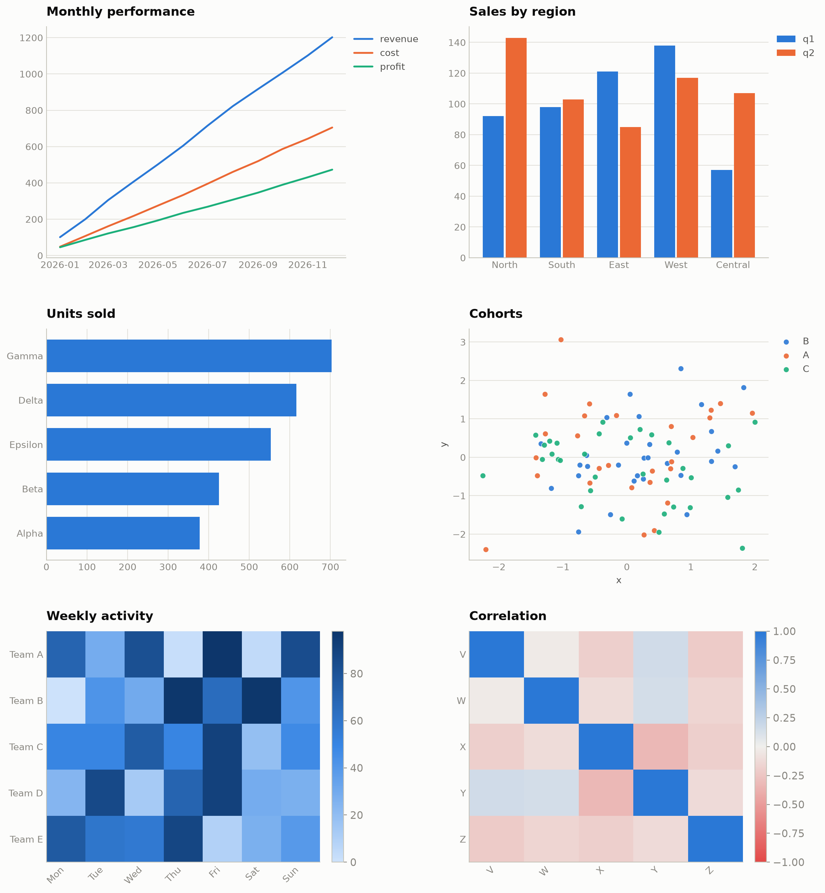
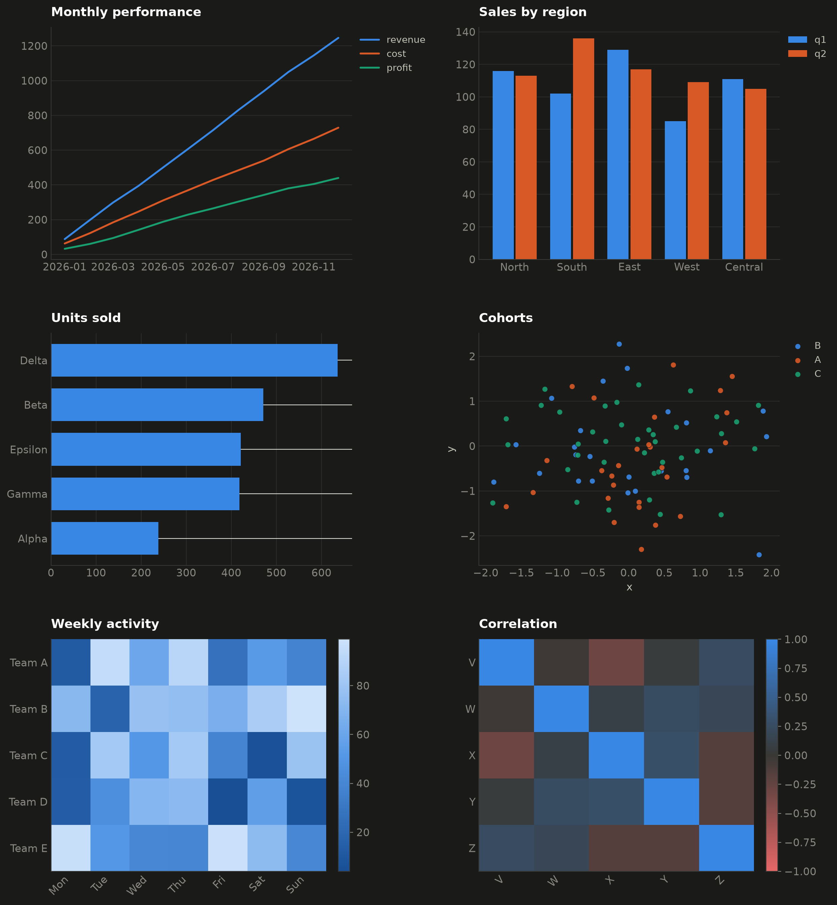

# vizlib

A tiny matplotlib visualization library (~190 lines) for **pandas DataFrames**,
with modern, minimal aesthetics and a **colorblind-safe** palette that works in
both light and dark modes.

- **DataFrame-native** — every function takes a `DataFrame` and column names.
- **Modern defaults** — no top/right spines, hairline gridlines on one axis,
  thin round-capped lines, left-aligned bold titles, legends outside the plot.
- **Colorblind-safe** — a validated 8-hue categorical palette applied in fixed
  order (never cycled); overflow folds into a single "Other" series.
- **Light & dark parity** — the same code renders either mode via a `dark=` flag.

## Install

```bash
pip install matplotlib pandas
```

`vizlib.py` is a single file — copy it into your project and `import vizlib`.

## Quick start

```python
import pandas as pd
import matplotlib.pyplot as plt
import vizlib as vz

df = pd.DataFrame({
    "month": pd.date_range("2026-01-01", periods=6, freq="MS"),
    "revenue": [100, 180, 260, 350, 430, 520],
    "cost":    [60, 110, 150, 210, 260, 300],
})

fig, ax = plt.subplots(figsize=(7, 4))
vz.line(df, x="month", y=["revenue", "cost"], ax=ax, title="Monthly performance")
vz.save(fig, "chart.png")          # background baked in for the chosen mode
```

## Examples

Six chart types, all from pandas DataFrames under the same criteria. Run
`python demo.py` to regenerate both images below.

### Light mode



### Dark mode



## API

Every plotting function accepts an existing `ax` (so you can compose subplots),
a `dark=False` flag, and an optional `title`.

| Function | Purpose |
|----------|---------|
| `line(df, x=None, y=None, ax=None, dark=False, title=None)` | One line per column in `y` (defaults to all **numeric** columns except `x`). `x` defaults to the index. |
| `bar(df, x, y, ax=None, dark=False, title=None, horizontal=False)` | Grouped bars: one group per row of `x`, one series per column in `y` (a single string works too). `horizontal=True` for a ranking. |
| `scatter(df, x, y, hue=None, ax=None, dark=False, title=None)` | Scatter of `x` vs `y`, optionally colored by categorical `hue` (max 3 groups — the colorblind-safe limit for scatter). |
| `heatmap(df, ax=None, dark=False, title=None, diverging=False)` | Heatmap of a numeric DataFrame. Sequential single-hue ramp by default; `diverging=True` for signed data (gray at zero). |
| `save(fig, path, dark=False, dpi=200)` | Save a figure with the correct theme background. |
| `palette(n, dark=False)` | The first `n` categorical colors in fixed order. |
| `apply_theme(dark=False)` | Apply the global rcParams theme (called for you by every chart). |

## Design notes

- **Fixed color order.** Categorical hues are assigned in a set order and never
  cycled. Colors follow the entity, not its rank.
- **Overflow folding.** Past `MAX_SERIES` (8), `line`/`bar` fold the extra
  columns into one gray "Other" series (row-wise sum) and emit a warning, so no
  two series ever share a color.
- **Scatter cap.** `scatter` allows at most `MAX_SCATTER_HUE` (3) hue groups —
  beyond three, the palette is not colorblind-safe for overlapping points. Facet
  into small multiples or add a marker-shape encoding for more.
- **Single hue for magnitude, two hues for polarity.** Sequential heatmaps use
  one hue light→dark; diverging heatmaps use two poles with a neutral gray
  midpoint — never a rainbow.

The palette is derived from a validated, colorblind-safe reference and passes
adjacent-pair CVD separation in both light and dark modes.
